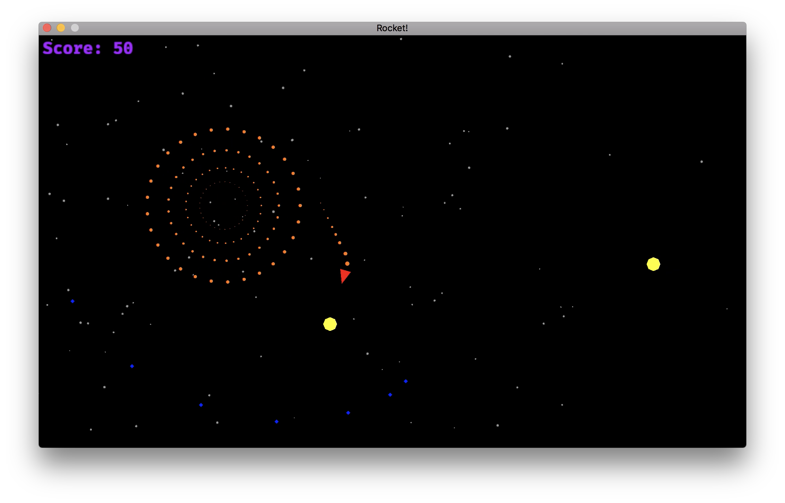

Rocket
======

> Rocket is a toy game written in Rust, using the Piston library. The code is thoroughly commented in order to help people to follow it easily.

## Screenshots



You can find more screenshots in the `screenshots` directory

## How to play

As you can see in the screenshots below, you are the red rocket and have to save the world from the yellow invaders. To do so, you can use the following controls:

Keyboard | Action
-------- | ------------
Up       | Boost
Left     | Rotate left
Right    | Rotate right
Space    | Shoot

## Running it with Cargo

As always, it is a real pleasure to work with Cargo. You only need the following:

```
cargo run --release
```

There is one non-Rust dependencies that you will need to install in order to compile the game:

1. The SDL2 library. Follow the instructions here to install it on your system: [Install SDL2](https://github.com/PistonDevelopers/hematite#getting-started)


## Why?

After having implemented some toy games in C++ using SDL and SFML, I thought it would be a good idea to try the same in Rust. Additionally, I had written a similar game in Haskell and wanted to port it to see the similarities and differences between Haskell and Rust. Another reason to program this game was to have an easy to follow Rust project that could be useful for people learning the language.

## License

MIT
